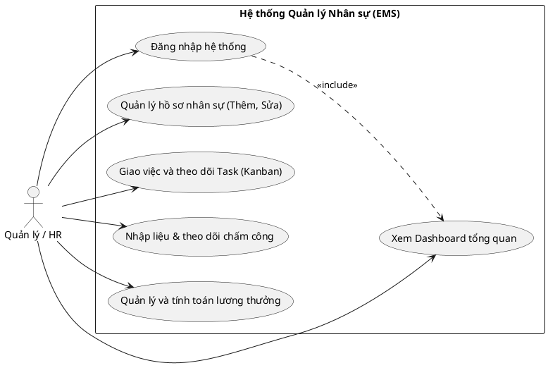
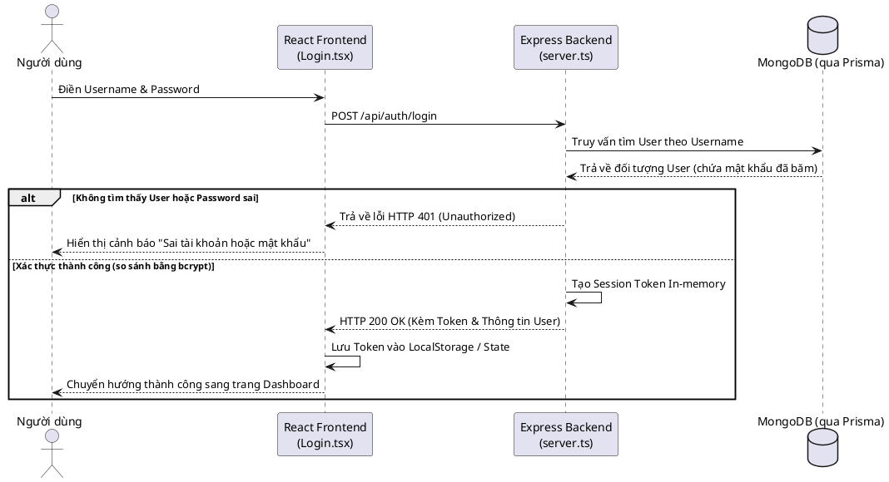
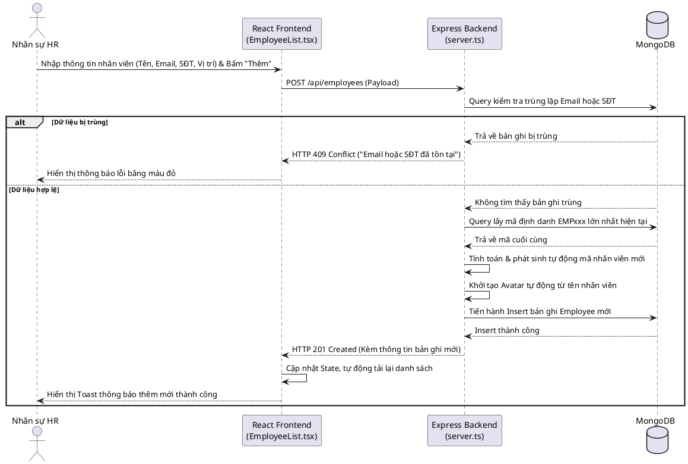
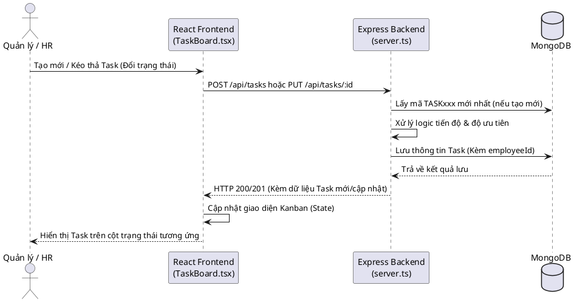
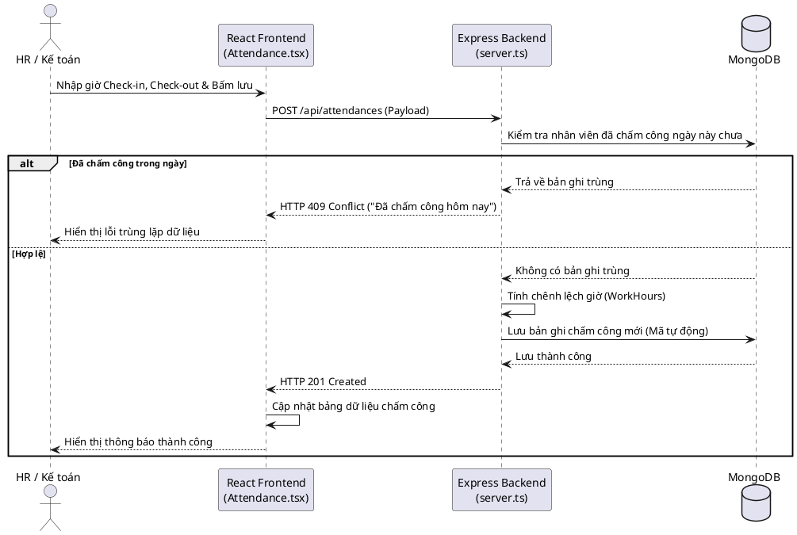
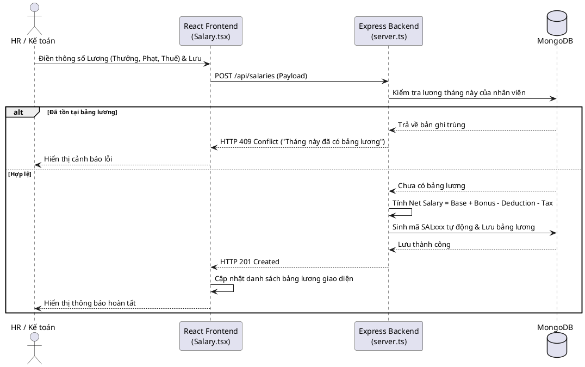

# BÁO CÁO MÔN HỌC: CÁC CÔNG NGHỆ LẬP TRÌNH HIỆN ĐẠI

**Trường Đại học / Cơ sở đào tạo:** [Tên trường của bạn]
**Môn học:** Các công nghệ lập trình hiện đại
**Giảng viên hướng dẫn:** [Tên giảng viên]
**Sinh viên thực hiện:** [Tên của bạn]
**Mã số sinh viên:** [Mã số sinh viên]
**Công nghệ ứng dụng trọng tâm:** Node.js, React, MongoDB
**Đề tài thực tiễn:** Xây dựng Hệ thống Quản lý Nhân sự tổng thể (Employee Management System)

---

## MỞ ĐẦU

Sự bùng nổ của mạng Internet và kỷ nguyên chuyển đổi số đã đặt ra những thách thức chưa từng có đối với việc phát triển các nền tảng ứng dụng trực tuyến. Các hệ thống phần mềm hiện đại ngày nay không chỉ dừng lại ở việc đáp ứng các tính năng nghiệp vụ mà còn phải thỏa mãn các tiêu chuẩn khắt khe về tốc độ phản hồi và khả năng chịu tải với số lượng lớn người truy cập cùng lúc. 

Trong quá trình tìm hiểu về các công nghệ máy chủ, em nhận thấy các mô hình máy chủ truyền thống (như Apache kết hợp PHP) thường sử dụng nguyên lý lập trình đa luồng (multi-threaded). Mô hình này tồn tại một nhược điểm cố hữu: mỗi yêu cầu từ người dùng sẽ chiếm dụng một luồng xử lý riêng biệt. Khi đối mặt với lượng truy cập lớn, máy chủ sẽ nhanh chóng cạn kiệt tài nguyên để duy trì các luồng này, dẫn đến hiện tượng "thắt cổ chai" (bottleneck) tại các tác vụ Input/Output (I/O).

Để giải bài toán này, công nghệ **Node.js** đã ra đời và tạo ra một cuộc cách mạng thực sự. Bằng cách áp dụng triết lý thiết kế **Đơn luồng (Single-threaded)**, **Hướng sự kiện (Event-driven)** và **Vào/Ra không chặn (Non-blocking I/O)**, Node.js mang lại hiệu suất đáng kinh ngạc cho các ứng dụng web.

Nhằm đi sâu vào việc nghiên cứu và ứng dụng công nghệ này trong thực tiễn môn học, báo cáo này được em trình bày theo hai phần chính:
1. **Phần I:** Khảo sát chi tiết lý thuyết, kiến trúc và nền tảng của công nghệ Node.js dưới góc nhìn kỹ thuật.
2. **Phần II:** Trình bày ứng dụng thực tiễn thông qua việc kiến trúc và xây dựng **Hệ thống Quản lý Nhân sự (Employee Management System)** - một sản phẩm do em phát triển kết hợp giữa môi trường Node.js phía máy chủ và thư viện React ở phía giao diện người dùng.

---

## PHẦN I – TỔNG QUAN VỀ CÔNG NGHỆ NODE.JS

### 1. Lịch sử hình thành và sự phát triển của nền tảng Node.js

#### 1.1. Bài toán C10K và khuyết điểm của máy chủ truyền thống
Để hiểu rõ lý do vì sao Node.js được sinh ra, em xin phép nhắc lại một vấn đề kinh điển trong giới lập trình mạng: **Bài toán C10K** (Làm sao để một máy chủ xử lý 10.000 kết nối đồng thời). 
Vào trước năm 2009, các máy chủ Web phổ biến như Apache chủ yếu vận hành dựa trên cơ chế **Đa luồng (Multi-threaded)**. Nguyên lý của cơ chế này khá đơn giản: Mỗi khi có một người dùng truy cập vào trang web, máy chủ sẽ tạo ra một luồng (thread) mới (hoặc lấy từ một hồ chứa - Thread Pool) để phục vụ riêng cho người đó. 
Tuy nhiên, điều này sinh ra một điểm yếu chết người: Khi luồng đó phải đọc một tệp dữ liệu lớn từ ổ cứng hoặc chờ phản hồi từ Cơ sở dữ liệu (Database), nó sẽ bị đình trệ, rơi vào trạng thái "chờ" (Blocking I/O). Trong lúc chờ đợi, luồng đó vẫn "ngốn" một lượng lớn RAM của máy chủ (thường từ 2MB đến 4MB cho mỗi luồng). Nếu có 10.000 người truy cập cùng lúc, máy chủ sẽ cần hàng chục Gigabyte RAM chỉ để duy trì các luồng đang "ngồi chờ", dẫn đến tình trạng treo máy hoặc sập hệ thống (Crash).

#### 1.2. Sự ra đời mang tính cách mạng của Node.js
Năm 2009, lập trình viên Ryan Dahl, trong lúc quan sát thanh tiến trình tải dữ liệu trên trang web Flickr, đã nhận ra sự lãng phí tài nguyên khổng lồ của mô hình Blocking I/O. Ông quyết tâm tìm ra một giải pháp khác: Xây dựng một máy chủ xử lý bất đồng bộ (Asynchronous) hoàn toàn.

Ryan Dahl đã lựa chọn **JavaScript** làm ngôn ngữ nền tảng. Lý do là vì trong JavaScript không hề có khái niệm đa luồng, nó là ngôn ngữ đơn luồng (Single-threaded). Điều kiện ép buộc này vô tình lại là một lợi thế, khiến lập trình viên bắt buộc phải thiết kế mọi thứ theo cơ chế **Không chặn (Non-blocking)**. 
Bằng cách lấy động cơ **V8 JavaScript Engine** (cốt lõi sức mạnh của trình duyệt Google Chrome) kết hợp cùng thư viện **libuv** (được viết bằng C++) để xử lý các tác vụ I/O, Ryan Dahl đã khai sinh ra **Node.js**. Ngay khi ra mắt tại hội nghị JSConf châu Âu cuối năm 2009, công nghệ này đã nhận được sự chú ý vô cùng to lớn.

#### 1.3. Các cột mốc phát triển quan trọng
Qua quá trình tìm hiểu, em xin liệt kê một số sự kiện quan trọng đã giúp định hình hệ sinh thái Node.js lớn mạnh như hiện tại:
- **Tháng 1/2010:** Ra mắt **npm (Node Package Manager)**. Đây là một cuộc cách mạng vì nó tạo ra một "chợ ứng dụng" nơi các lập trình viên trên toàn cầu có thể chia sẻ các đoạn code (package) miễn phí.
- **Năm 2011:** Nhờ sự tài trợ của Microsoft, Node.js chính thức hỗ trợ môi trường Windows nguyên bản, giúp số lượng người dùng tăng theo cấp số nhân.
- **Năm 2015:** Thành lập tổ chức **Node.js Foundation** (nay là OpenJS Foundation), đưa Node.js trở thành tài sản chung của cộng đồng, không phụ thuộc vào công ty tư nhân nào.
- **Giai đoạn hiện tại (2026):** Node.js tiếp tục phát hành theo chu kỳ vòng đời dài hạn (LTS - Long Term Support) với các bản cập nhật v24, v26 mang đến nhiều tính năng cải tiến cực mạnh như hỗ trợ TypeScript trực tiếp và tối ưu hóa Worker Threads.

---

### 2. Nguyên lý hoạt động và Kiến trúc vi mô

Để giải thích tại sao Node.js chỉ có một luồng duy nhất mà lại nhanh hơn cả các máy chủ có hàng chục luồng, em xin phân tích chi tiết vào 3 thành phần cốt lõi tạo nên sức mạnh của Node.js. Để dễ hình dung, em xin dùng một ví dụ ẩn dụ về "Một quán cà phê".

#### 2.1. Động cơ V8 (V8 JavaScript Engine) - "Bộ não xử lý tốc độ cao"
JavaScript vốn là ngôn ngữ thông dịch (chạy tới đâu dịch tới đó), nên trước đây nó nổi tiếng là chậm. Tuy nhiên, Node.js sử dụng V8 Engine của Google. Động cơ này áp dụng kỹ thuật **Biên dịch tức thời (Just-In-Time - JIT Compilation)**. Nó dịch thẳng toàn bộ mã JavaScript thành ngôn ngữ máy (Machine code) ở cấp độ vi xử lý phần cứng. Nhờ vậy, tốc độ tính toán thuần túy của Node.js được đẩy lên cực cao, nhanh không kém gì các ngôn ngữ biên dịch mạnh mẽ như C++ hay Java.

#### 2.2. Thư viện libuv và Thread Pool - "Đội ngũ nhân viên nhà bếp"
Trong Node.js, chỉ có một luồng chính duy nhất xử lý code JavaScript (giống như Quán cà phê chỉ có đúng **1 bạn Nhân viên thu ngân**). Vậy khi gặp các công việc nặng như đọc file từ ổ cứng hay truy xuất dữ liệu, làm sao nhân viên này không bị quá tải?
Câu trả lời nằm ở thư viện **libuv**. Thư viện này chứa đựng một **Thread Pool** (Bể luồng - giống như các đầu bếp phía sau nhà bếp). 
Khi luồng chính gặp một tác vụ I/O nặng nề (ví dụ: truy vấn CSDL từ MongoDB), nó sẽ không tự làm mà lập tức "quăng" công việc đó cho thư viện libuv xử lý ngầm (đưa bill cho nhà bếp). Nhờ vậy, luồng chính (bạn thu ngân) lập tức rảnh tay để quay lại tiếp tục nhận yêu cầu từ hàng ngàn khách hàng khác đang xếp hàng.

#### 2.3. Vòng lặp sự kiện (Event Loop) - "Người quản lý điều phối"
Event Loop chính là trái tim của Node.js. Nó là một vòng lặp chạy liên tục vô tận. Nhiệm vụ của nó là kiểm tra xem "nhà bếp" (libuv) đã làm xong việc chưa.
Quy trình diễn ra như sau:
1. Máy chủ nhận hàng ngàn Request từ người dùng (Khách hàng order cà phê).
2. Event Loop tiếp nhận và giao ngay cho hệ điều hành hoặc libuv xử lý ngầm (Giao bill cho nhà bếp).
3. Event Loop không đứng chờ mà quay lại quầy để tiếp các yêu cầu của khách khác.
4. Khi Database trả về dữ liệu (Cà phê pha xong), libuv sẽ đặt một thông báo (Callback) vào một hàng đợi (Task Queue).
5. Event Loop sẽ liên tục quét qua hàng đợi này. Khi thấy có kết quả, nó sẽ lấy ra và trả về ngay cho khách hàng ban đầu (Giao cà phê cho khách).

Sự kết hợp hoàn hảo này tạo ra một mô hình **Non-blocking I/O (Vào/Ra không chặn)**, giúp Node.js giải quyết bài toán C10K một cách xuất sắc với lượng RAM tiêu thụ cực kỳ nhỏ do không phải sinh ra thêm luồng mới dư thừa.

---

### 3. Đánh giá Ưu điểm và Hạn chế

Dù rất mạnh mẽ, nhưng không có công nghệ nào là hoàn hảo tuyệt đối. Qua quá trình làm đồ án và nghiên cứu, em đã tự rút ra được các ưu và nhược điểm cốt lõi của công nghệ này.

#### 3.1. Các điểm mạnh cốt lõi
- **Hiệu suất tuyệt vời với I/O:** Vì sử dụng cơ chế Non-blocking I/O, máy chủ Node.js không bị lãng phí RAM cho các luồng rảnh rỗi. Nó đặc biệt tỏa sáng khi làm việc với các hệ thống cần đọc/ghi dữ liệu liên tục như ứng dụng Chat, hay xây dựng các Web API trả về dạng JSON (như đồ án của em).
- **Hệ sinh thái mã nguồn mở khổng lồ:** Với việc tải thư viện bằng lệnh `npm`, lập trình viên gần như có sẵn mọi công cụ trên đời: từ thư viện mã hóa mật khẩu (`bcrypt`), kết nối Database (`Prisma`), cho đến tạo file Excel. Điều này giúp đẩy nhanh tốc độ hoàn thành dự án lên rất nhiều lần.
- **Sự đồng nhất về ngôn ngữ (Full-stack JavaScript):** Trước đây, để làm web, chúng ta phải học PHP/Java cho phía máy chủ và JavaScript cho phía giao diện. Với nền tảng này, sinh viên chúng em chỉ cần tinh thông duy nhất một ngôn ngữ là JavaScript/TypeScript để phát triển toàn bộ sản phẩm. Điều này giảm tải áp lực học tập và tối ưu hóa khả năng tái sử dụng code.

#### 3.2. Những giới hạn và nhược điểm
- **Điểm yếu chí mạng với tác vụ nặng về CPU (CPU-bound tasks):** Vì bản chất Node.js chỉ có 1 luồng chính (Main thread), nếu ta bắt luồng này làm một công việc tính toán quá phức tạp và kéo dài (Ví dụ: Encode một đoạn video 4K, hay huấn luyện mô hình Trí tuệ nhân tạo mất 5 giây), thì luồng chính này sẽ bị "đóng băng" trong 5 giây. Hậu quả là toàn bộ các người dùng khác truy cập vào trang web trong 5 giây đó đều bị treo (vì "nhân viên thu ngân" đang bận). Vì vậy, em nhận thấy Node.js tuyệt đối không ưu tiên dùng cho các phần mềm liên quan đến AI hay xử lý hình ảnh phức tạp.
- **Vấn đề "Địa ngục gọi lại" (Callback Hell):** Do bản chất làm việc không đồng bộ, trước đây lập trình viên phải viết các hàm "gọi lại" (callback) lồng ghép vào nhau liên tục để chờ kết quả. Mã nguồn khi đó lùi thụt vào như một hình kim tự tháp, vô cùng khó đọc và khó bắt lỗi. Dù hiện tại cú pháp `async / await` đã ra đời giúp code nhìn gọn gàng hơn như code đồng bộ, nhưng nó vẫn đòi hỏi lập trình viên phải thật sự am hiểu luồng chạy nếu không sẽ rất dễ sinh ra lỗi ngầm.

---

### 4. Khả năng ứng dụng trong thực tế

Để chứng minh sức mạnh của Node.js không chỉ nằm trên lý thuyết, em xin đưa ra một số ví dụ thực tiễn về cách các "ông lớn" công nghệ trên thế giới đang tận dụng nền tảng này:

- **Các ứng dụng tương tác thời gian thực (Real-time Applications):** Các nền tảng yêu cầu trao đổi dữ liệu liên tục không có độ trễ như **Slack, Discord (Nhắn tin), Trello (Cộng tác làm việc)**. Việc kết nối WebSocket duy trì liên tục rất tiêu tốn tài nguyên ở các máy chủ truyền thống, nhưng với kiến trúc Non-blocking của Node.js, mọi thứ trở nên nhẹ nhàng hơn rất nhiều.
- **Phục vụ luồng dữ liệu truyền phát (Data Streaming):** Tập đoàn giải trí **Netflix** đã chuyển đổi hệ thống giao diện người dùng của họ từ ngôn ngữ Java sang Node.js. Nhờ khả năng xử lý dữ liệu theo từng luồng khối nhỏ (Stream) cực tốt của Node.js, thời gian khởi động máy chủ của Netflix đã giảm từ 40 phút xuống chỉ còn dưới 1 phút.
- **Kiến trúc Vi dịch vụ (Microservices):** Thay vì làm một hệ thống khổng lồ gánh vác mọi chức năng (Monolithic), các công ty như **PayPal, Uber** đã chia nhỏ hệ thống thành hàng trăm máy chủ Node.js cục bộ cực nhỏ. Vì Node.js khởi động rất nhanh và chạy tốn ít RAM, việc đưa chúng lên hệ thống đám mây (Cloud/Docker) giúp các tập đoàn này tiết kiệm hàng triệu đô la chi phí máy chủ và dễ dàng bảo trì từng dịch vụ độc lập.

---

## PHẦN II – ỨNG DỤNG MINH HỌA: HỆ THỐNG QUẢN LÝ NHÂN SỰ

Nhằm hiện thực hóa lý thuyết đã tìm hiểu ở Phần I, em đã tự tay kiến trúc và phát triển dự án **Employee Management System (Hệ thống Quản lý Nhân sự)**. Thông qua đồ án này, em muốn ứng dụng khả năng kết nối linh hoạt của Node.js để tạo ra một hệ thống Web hoàn chỉnh, phục vụ cho nghiệp vụ nội bộ của doanh nghiệp.

### 1. Tổng quan về dự án Hệ thống Quản lý Nhân sự

**1.1. Vấn đề thực tiễn và Bối cảnh xây dựng**
Quản lý nguồn nhân lực đóng vai trò huyết mạch trong tổ chức. Thông thường, thông tin nhân viên, quá trình chấm công và tính lương thường bị phân mảnh trên nhiều phần mềm hoặc file Excel khác nhau, gây mất thời gian đối chiếu.
Do đó, em quyết định xây dựng hệ thống này như một giải pháp tập trung, số hóa toàn bộ quy trình từ lưu trữ thông tin cá nhân, giao việc, chấm công cho đến quyết toán lương.

**1.2. Đối tượng người dùng và Yêu cầu khách hàng (User-Requirements)**
Ứng dụng trong phiên bản đồ án hiện tại của em hướng tới nhóm người dùng quản trị (HR, Quản lý) để thao tác Nhập/Xuất thông tin và vận hành luồng nhân sự. Em đã tiến hành khảo sát và tóm tắt các yêu cầu từ phía khách hàng (doanh nghiệp) thành Bảng phân tích User-Requirement sau đây:

| Nhóm đối tượng | Yêu cầu nghiệp vụ (User Requirement) | Chức năng hệ thống đáp ứng |
| :--- | :--- | :--- |
| **Ban Giám đốc** | Cần theo dõi tổng quan quy mô nhân sự, tiến độ dự án hiện tại và tỷ lệ chuyên cần của công ty. | Bảng điều khiển tổng hợp (Dashboard) với các chỉ số báo cáo thời gian thực. |
| **Bộ phận HR** | Quản lý, lưu trữ, thêm mới và chỉnh sửa hồ sơ nhân sự. Ngăn chặn việc tạo trùng lặp nhân viên. | Quản lý Hồ sơ nhân sự (CRUD Employee), chặn lưu trùng Email/Số điện thoại. |
| **Bộ phận HR** | Chấm công nhanh chóng và theo dõi số giờ làm việc thực tế hằng ngày của nhân sự. | Theo dõi Chấm công tự động, tự động tính Work Hours từ giờ Check-in/Check-out. |
| **Bộ phận Kế toán** | Tính lương cuối tháng nhanh chóng, chính xác, tự động cộng trừ thưởng, phạt, thuế. | Mô-đun Quản lý và Tính lương tự động dựa trên mức lương cơ sở. |
| **Trưởng phòng dự án** | Phân chia công việc, giao việc xuống từng nhân sự, đánh giá mức độ ưu tiên và theo dõi tiến độ hoàn thành. | Bảng quản lý Công việc (Task Board) theo dạng bảng tương tác Kanban. |

---

### 2. Nền tảng công nghệ em đã sử dụng (Tech Stack)

Để hệ thống hoạt động mượt mà và hiện đại nhất, em đã áp dụng cấu trúc nền tảng **MERN-Stack** kết hợp cùng công nghệ quản trị cơ sở dữ liệu mới nhất.

**Khối logic máy chủ (Backend):**
- **Node.js & Express.js (v5):** Đóng vai trò là máy chủ trung tâm. Em dùng Express để viết các API (Routing), điều hướng các yêu cầu HTTP và trả về dữ liệu chuẩn JSON.
- **MongoDB:** Hệ quản trị cơ sở dữ liệu NoSQL, giúp em linh hoạt hơn trong việc thay đổi cấu trúc bảng lưu trữ thông tin nhân viên.
- **Prisma ORM:** Thay vì dùng Mongoose như truyền thống, em chọn Prisma làm cầu nối với MongoDB. Prisma giúp em kiểm soát kiểu dữ liệu (Type-safety) cực kỳ chặt chẽ, tự động cảnh báo lỗi ngay lúc viết code.
- **Thư viện phụ trợ:** Em dùng `bcryptjs` để băm mật khẩu bảo mật và `dotenv` để giấu các biến môi trường nhạy cảm.

**Khối biểu diễn giao diện (Frontend):**
- **React 19 & Vite:** Em dùng React để xây dựng trải nghiệm Single Page Application (SPA). Người dùng khi thao tác chuyển trang sẽ không hề bị tải lại (reload) trình duyệt.
- **Tailwind CSS v4:** Giúp em viết CSS cực kỳ nhanh gọn theo chuẩn tiện ích (Utility-first), tạo ra giao diện hiện đại, sáng sủa.
- **Lucide-React:** Bộ icon mã nguồn mở giúp giao diện trực quan hơn.

**Ngôn ngữ bao trùm:** Em sử dụng **TypeScript** cho toàn bộ dự án từ Frontend xuống Backend để đảm bảo mã nguồn chuyên nghiệp, dễ bảo trì và hạn chế tối đa lỗi ngầm.

---

### 3. Kiến trúc hệ thống
Hệ thống của em tuân thủ mô hình **Client - Server** qua chuẩn **RESTful API**.
Ví dụ, khi thao tác trên giao diện:
- Hàm `GET /api/employees` để lấy toàn bộ danh sách nhân sự.
- Hàm `POST /api/tasks` để lưu công việc mới.
Tất cả các mô-đun trong CSDL (`Task`, `Attendance`, `SalaryRecord`) đều được em thiết lập liên kết bằng khóa ngoại (Foreign key) trỏ về mô-đun gốc là `Employee`. Do đó, khi truy vấn, Node.js sẽ gom toàn bộ dữ liệu trả về cho giao diện một cách đồng bộ.

#### 3.1. Các biểu đồ mô hình hóa hệ thống (UML Diagrams)

Để làm rõ hơn về các luồng nghiệp vụ và cách hệ thống phục vụ người dùng, em đã thiết kế các biểu đồ Use-case và Sequence bằng ngôn ngữ PlantUML.

**A. Biểu đồ Use-case (Tổng quan hệ thống)**
Sơ đồ sau mô tả các ca sử dụng (Use-case) chính mà hệ thống cung cấp cho người quản trị (Admin/HR).

**B. Biểu đồ Tuần tự (Sequence Diagram) - Luồng Đăng nhập**
Sơ đồ mô tả quy trình mã hóa và xác thực bảo mật giữa Client và máy chủ Node.js khi quản trị viên đăng nhập.

**C. Biểu đồ Tuần tự (Sequence Diagram) - Luồng Thêm mới nhân sự**
Sơ đồ mô tả quy trình phía Backend (Node.js) nhận dữ liệu, kiểm tra tính toàn vẹn (chống trùng lặp) và sinh mã định danh tự động (EMPxxx) trước khi lưu trữ xuống Database.

**D. Biểu đồ Tuần tự (Sequence Diagram) - Luồng Quản lý công việc (Task Board)**
Sơ đồ mô tả quy trình người dùng khởi tạo công việc mới hoặc cập nhật trạng thái tiến độ công việc trên bảng Kanban.

**E. Biểu đồ Tuần tự (Sequence Diagram) - Luồng Theo dõi chấm công**
Sơ đồ mô tả quy trình tính toán tự động số giờ làm việc thực tế dựa trên mốc thời gian Check-in và Check-out do Node.js thực hiện ở lớp Backend.

**F. Biểu đồ Tuần tự (Sequence Diagram) - Luồng Quản lý quyết toán lương**
Sơ đồ mô tả quy trình tiếp nhận các thông số phụ trợ (Thưởng, Phạt, Thuế) từ người dùng và tự động chạy công thức tính lương thực nhận.

---

### 4. Các chức năng chính (Phân tích chi tiết)

*(Lưu ý: Thầy/Cô có thể xem các hình ảnh `[Ảnh minh họa: ...]` kèm theo ở bên dưới để đối chiếu với giao diện thực tế của ứng dụng)*

#### 4.1. Mô-đun Xác thực và Phân quyền (Authentication)
Ở màn hình đăng nhập, em thiết kế một Form trên React để nhận tài khoản. Phía Backend, mật khẩu không bao giờ được lưu dạng chữ thường mà em dùng thuật toán `bcrypt.hash` để băm (mã hóa) chúng. Khi đăng nhập thành công, máy chủ Node.js của em sẽ phát sinh một Token bảo mật lưu tạm trong bộ nhớ (In-memory Session) để cấp quyền truy cập các chức năng nội bộ.
> `[Ảnh minh họa: Giao diện hệ thống Đăng nhập (Login.tsx)]`

#### 4.2. Bảng điều khiển quản trị (Admin Dashboard)
Đây là trang đích sau khi người dùng đăng nhập. Em đã dùng React `useEffect` để gọi đồng thời nhiều API xuống server cùng lúc (thay vì gọi từng cái một) bằng cơ chế `Promise.all`. Môi trường Single-threaded của Node.js dễ dàng phục vụ nhiều truy vấn này và trả về dữ liệu rất nhanh. Dashboard cung cấp các thẻ tổng hợp về tổng số nhân sự, chuyên cần và tiến độ công việc.
> `[Ảnh minh họa: Màn hình Bảng điều khiển tổng quan (Dashboard.tsx)]`

#### 4.3. Mô-đun Quản lý Hồ sơ Nhân sự (Employee Records)
Đây là bộ phận quản lý cốt lõi. Khi thêm nhân viên mới, Backend của em sẽ kiểm tra xem mã nhân viên mới nhất là bao nhiêu, sau đó tự động cộng dồn sinh ra mã định danh thống nhất (ví dụ `EMP005`). 
Em cũng lập trình cơ chế bắt lỗi ở Backend: nếu người dùng nhập trùng Email hoặc Số điện thoại đã có, Node.js sẽ chặn lại và báo lỗi HTTP 409 (Conflict), từ đó React hiển thị cảnh báo đỏ trên màn hình để HR sửa lại. Ngoài ra, hình đại diện (Avatar) cũng được em cho tự động sinh ra từ chữ cái đầu tiên của tên nhân viên.
> `[Ảnh minh họa: Giao diện quản lý danh sách nhân sự (EmployeeList.tsx)]`

#### 4.4. Mô-đun Quản lý Công việc (Task Board)
Em thiết kế phần này theo tư duy bảng Kanban (giống Trello), chia làm 3 cột: To do, In Progress, và Done. 
Công việc được gán trực tiếp cho từng nhân sự (`employeeId`). Từ giao diện, người dùng có thể dễ dàng khai báo tiến độ (progress bar) và chọn mức độ ưu tiên (High, Medium, Low). Node.js sẽ lưu lại mọi sự thay đổi trạng thái này vào cơ sở dữ liệu MongoDB.
> `[Ảnh minh họa: Bảng giao việc Kanban Board (TaskBoard.tsx)]`

#### 4.5. Mô-đun Theo dõi Chấm công (Attendance Tracking)
Thay vì để kế toán tính toán thủ công, em đã lập trình chức năng tính giờ tự động. 
Trên giao diện nhập giờ Check-in và Check-out, khi dữ liệu gửi xuống Backend, Node.js sẽ chạy một công thức toán học nội bộ để quy đổi thời gian ra số thập phân, sau đó tính chênh lệch để đưa ra chính xác Tổng số giờ làm việc (Work Hours) của nhân viên trong ngày. Nó cũng chặn không cho một nhân viên được chấm công 2 lần trong cùng một ngày.
> `[Ảnh minh họa: Màn hình quản trị chấm công hằng ngày (Attendance.tsx)]`

#### 4.6. Mô-đun Quản lý và Quyết toán Lương (Salary Management)
Đây là mô-đun tổng hợp. Form tính lương của em lấy thông số Lương cơ bản, kết hợp với các ô nhập Tiền Thưởng, Tiền Phạt, và Thuế.
Mọi thuật toán tính lương em đều đặt dưới Backend để bảo mật: `Lương thực nhận = Cơ bản + Thưởng - Phạt - Thuế`. Bảng lương sau khi tạo sẽ được gán mã giao dịch tự động dạng `SALxxx` và lưu vào lịch sử CSDL.
> `[Ảnh minh họa: Module tính toán lương thưởng (Salary.tsx)]`

*(Ghi chú: Đối với tính năng Báo cáo - Report, em đang tạm ẩn để tiến hành tối ưu hóa thêm dữ liệu và sẽ ra mắt trong phiên bản định hướng tương lai).*

---

### 5. Hướng dẫn Triển khai và Cài đặt
Để chạy được ứng dụng của em trên máy tính cá nhân, quy trình cài đặt được thực hiện qua các bước sau:

**Bước 1: Chuẩn bị môi trường**
- Cài đặt Node.js (phiên bản v20 trở lên) và MongoDB.

**Bước 2: Tải thư viện (Dependencies)**
- Mở Terminal ở thư mục dự án, chạy lệnh `npm install` để hệ thống tự động tải về Express, React, Tailwind, Prisma vào thư mục `node_modules`.

**Bước 3: Cấu hình biến môi trường**
- Tạo file `.env` từ file `.env.example`.
- Điền đường dẫn Database vào biến `DATABASE_URL` (ví dụ: `mongodb://localhost:27017/employee_db`).

**Bước 4: Khởi tạo CSDL**
- Chạy lệnh `npx prisma generate` để tạo Prisma Client.
- (Tùy chọn) Chạy lệnh `npm run seed` để em bơm một số dữ liệu mẫu ban đầu (tài khoản admin, nhân sự ảo) vào hệ thống để test.

**Bước 5: Khởi động Ứng dụng**
Mở 2 Terminal riêng biệt:
1. **Chạy Backend Server:** Dùng lệnh `npm run server:dev` (Server sẽ chạy ở cổng 3001).
2. **Chạy Frontend React:** Dùng lệnh `npm run dev` (Giao diện hiển thị ở cổng `http://localhost:5173`).
Mở trình duyệt, truy cập `localhost:5173` và đăng nhập sử dụng.

---

### 6. Hướng phát triển thêm trong tương lai của ứng dụng

Tuy ứng dụng hiện tại đã giải quyết được phần lớn các nghiệp vụ cơ sở, nhưng để hoàn thiện hệ sinh thái quản lý toàn diện hơn, nhóm chúng em đã hoạch định chiến lược phát triển ứng dụng trong các phiên bản tiếp theo với hai trọng tâm cốt lõi:

**6.1. Phát triển Mô-đun Báo cáo (Reports & Analytics)**
Em dự kiến sẽ tái kích hoạt và phát triển sâu hơn chức năng Báo cáo (Report). Tính năng này sẽ tự động tổng hợp toàn bộ dữ liệu của toàn công ty hoặc chia theo từng phòng ban (chi phí lương thưởng theo tháng, năng suất hoàn thành task của bộ phận). Sử dụng thư viện Recharts để vẽ các biểu đồ động trực quan, giúp Ban Giám đốc dễ dàng truy vấn, đưa ra các quyết định về mặt tài chính và nhân sự một cách nhanh chóng nhất mà không cần phải tra cứu số liệu thô.

**6.2. Phân tách Cổng thông tin (Dual Portal System)**
Mục tiêu dài hạn của dự án là biến ứng dụng thành một phần mềm nội bộ duy nhất (All-in-one Intranet) dành cho cả Nhân viên và Ban quản lý, được chia làm 2 cổng truy cập với mục đích sử dụng rõ ràng:
- **Ứng dụng dành cho Nhân viên (Employee Portal):**
  Nhân viên sẽ có tài khoản riêng để đăng nhập. Tại đây, họ có thể tự giác Check-in/Check-out hằng ngày, xem danh sách công việc (Task) được giao và tự kéo thả cập nhật tiến độ công việc của mình. Đặc biệt, em sẽ tích hợp thêm tính năng WebSockets của Node.js để xây dựng công cụ **Chat nội bộ** (giao tiếp trực tuyến theo phòng ban), giúp nhân sự trao đổi công việc tiện lợi ngay trên hệ thống.
- **Ứng dụng dành cho Trưởng phòng / Sếp (Manager Portal):**
  Đối với cấp quản lý, giao diện sẽ tập trung vào việc quản trị vĩ mô. Trưởng phòng có thể theo dõi biểu đồ tiến độ công việc của nhân viên cấp dưới, sắp xếp và giao việc, lên lịch các cuộc họp định kỳ. Đồng thời, công cụ cũng cung cấp quyền hạn duyệt tính lương, xét mức thưởng phạt tự động dựa trên chuyên cần và năng suất công việc của từng cá nhân mà hệ thống báo cáo lại.

---

## TỔNG KẾT

Thông qua việc thực hiện đồ án "Các công nghệ lập trình hiện đại", em đã có cơ hội tìm hiểu sâu sắc và ứng dụng thành công nền tảng Node.js cùng hệ sinh thái lập trình Web tiên tiến vào một bài toán quản trị nhân sự thực tế. Về mặt lý thuyết, em đã hiểu rõ hơn về kiến trúc hướng sự kiện (Event-driven) và Non-blocking I/O. Về mặt thực hành, qua quá trình tự tay viết code lắp ghép các thành phần từ Backend (Express, Prisma, MongoDB) đến Frontend (React, TailwindCSS), em đã nắm được cách thức luân chuyển luồng dữ liệu thông qua RESTful API.

Tuy nhiên, nhìn lại toàn bộ quá trình phát triển dự án, em tự nhận thấy đồ án vẫn còn rất nhiều hạn chế và khiếm khuyết. Trước hết, quá trình viết code từ Backend đến Frontend của em không hoàn toàn đi từ con số không, mà có sự tham khảo, vận dụng từ các template mã nguồn chia sẻ trên mạng, cũng như nhận được sự giúp sức đắc lực từ các công cụ hỗ trợ lập trình hiện đại khác. 

Bên cạnh đó, vì không có nhiều thì giờ, cũng như đồ án em làm hoàn toàn độc lập (một mình), nên ứng dụng đã có nhiều sai sót cũng như thiếu vắng nhiều chức năng quan trọng. 

Em xin chân thành gửi lời xin lỗi đến cô vì những sai sót trong quá trình code và sự thiếu hoàn thiện của sản phẩm lần này. Khả năng bao quát dự án và năng lực lập trình của em hiện tại vẫn còn nhiều giới hạn, dẫn đến kết quả chưa thực sự hoàn hảo như mong đợi. Em rất mong cô sẽ lượng thứ, thông cảm cho những khó khăn trong quá trình làm việc độc lập của em và xem xét bỏ qua cho sự thiếu năng lực này của em.

Dù kết quả chưa trọn vẹn, nhưng những kiến thức và bài học kinh nghiệm rút ra từ những lỗi sai trong đồ án này chắc chắn sẽ là hành trang vô giá giúp em hoàn thiện bản thân hơn nữa. Một lần nữa, em xin chân thành cảm ơn cô vì đã tận tình giảng dạy và tạo điều kiện cho em hoàn thành môn học này!

---

## TÀI LIỆU THAM KHẢO

1. **Ryan Dahl (2009).** *Node.js Presentation at JSConf EU*.
2. **Node.js Official Documentation (LTS).** Truy cập tại: https://nodejs.org/docs - Tham khảo về kiến trúc Event Loop, libuv.
3. **Casciaro, M., & Mammino, L. (2020).** *Node.js Design Patterns (3rd Edition)*. NXB Packt Publishing.
4. **Prisma Official Documentation.** Truy cập tại: https://www.prisma.io/docs - Sử dụng làm tài liệu tham khảo cho việc thiết kế ORM tích hợp MongoDB.
5. **React.js Team (Meta).** *React 19 Documentation*. Truy cập tại: https://react.dev - Tham khảo về Quản trị luồng trạng thái (State) và Hooks.
6. **Thư viện Tailwind CSS Documentation.** Truy cập tại: https://tailwindcss.com/docs - Áp dụng thiết kế giao diện Utility-first.
